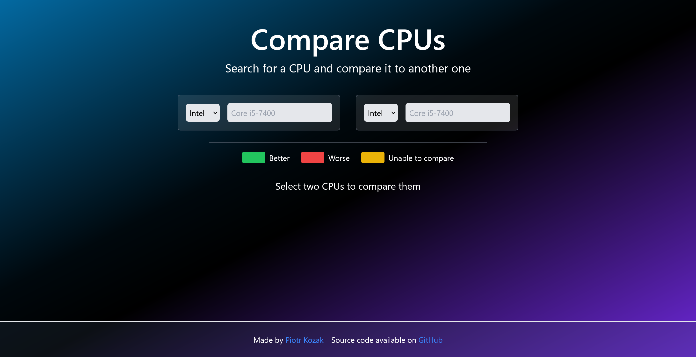

# Comparator

A simple [web app](https://comparator.pkozak.org) for comparing cpus. No bloat, just quick and easy comparison.  
This project was build with backwards compatibility in mind, so that even 12-year-old cpus can be compared.

## How does it work?

The data is scraped from each manufacturer's website. The data is then cached in a redis database, to ensure blazing
fast response times. If the data is older than required by the app, it will be updated.

The selected cpus are saved in the url, so that you can share your comparison with others.

## How to use

Simply select the manufacturer and the model of the cpu you want to compare. The data will automatically fetch, after
the bar vanishes or after pressing enter.

After both cpus are loaded (indicated by the green color), the comparison table will be displayed.

## How do you get the data exactly?

### Cache

The app always tries to fetch the data from the redis cache first. If the data is not in the cache, it will be fetched
from
the manufacturer's website, using the approaches described below.

### Intel

Getting the data for intel cpus was not that hard. I simply used their internal search API, that is used for search on
their own website.
The only con of this approach is, that by simply searching a phrase like `Core`, it can return a random cpu.

### Problem with AMD

Getting the data for AMD cpus was a bit more tricky. AMD does not have an internal search API, but I discovered an
endpoint that returns a list with links to all AMD products. The first problem was, not all links contain the name of
the cpu. The second problem was, that the sites to which the links point to, are **very** inconsistent, as they are more
of a marketing page. Luckily there is a link to the specification page, which is still not very consistent, but it's
**much** better.

The third and the biggest problem was, that AMD doesn't like being fetched by a server. In the end I ended up spinning
my own instance of
[Browserless](https://browserless.io) and using it to fetch the data. This is not ideal and adds lots of delay (
approximately 6-7 seconds), but that's better than nothing.

Overall the AMD data is not as accurate and is very unreliable. For example, they can have two release dates for the
same cpu on one page.

### Tech stack

- [Next.js](https://nextjs.org/)
- [Upstash](https://upstash.com/)
- [TypeScript](https://www.typescriptlang.org/)
- [TailwindCSS](https://tailwindcss.com/)